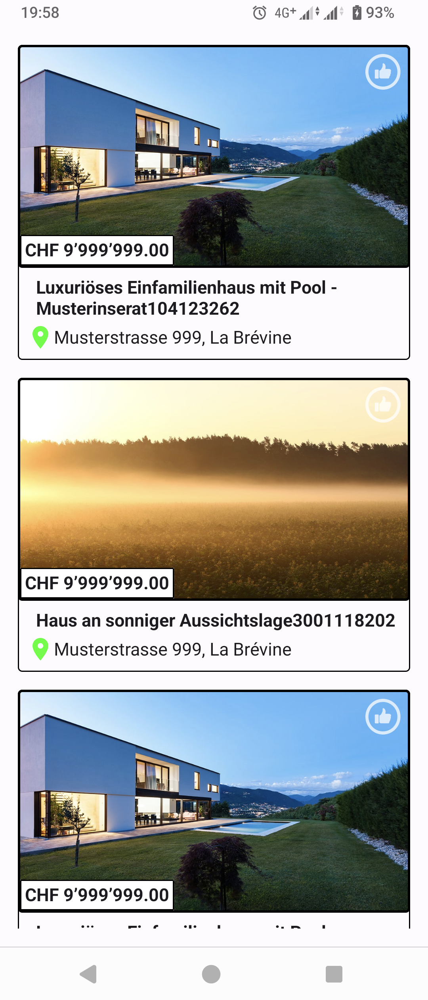
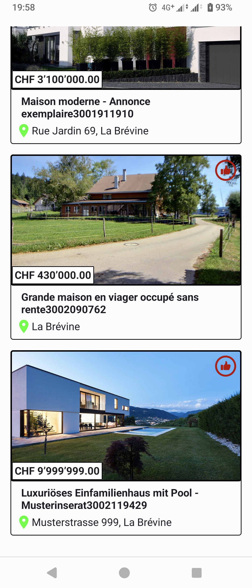
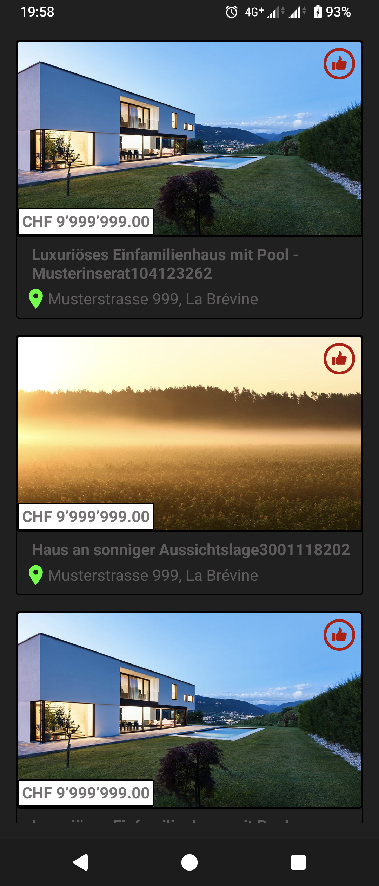

# SMG Real Estate - Demo App

> App fetches real estate from a mockup API, stores it locally, and presents it in a list.
> It allows users to bookmark real estate items and save their selection into a local DB.
> It supports screen rotation, switching between dark and light themes, swipe-to-refresh for reloading data, and data reloading in case an error occurs.

# App Screenshots
<table>
  <tr>
    <td></td>
    <td></td>
    <td></td>
  </tr>
</table>

